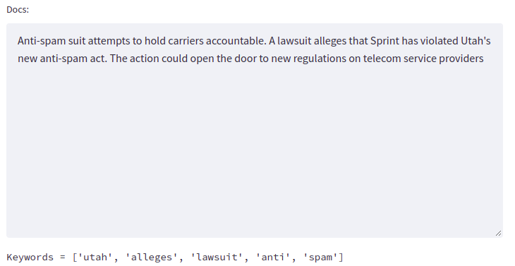
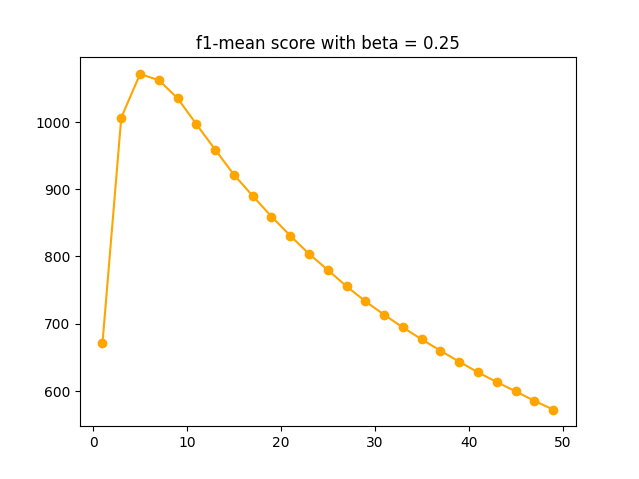

## Introduction 
+ Inspec keyword extraction is the task of extracting keywords from texts and praticed on the Inspec dataset. The result is archived about 
precision = 0.667 and recall = 0.129.

+ We used TF-IDF to vectorize the copur and select tokens that have the highest weight (5 tokens) on each text to present as keywords.

## Result

    
  

    
